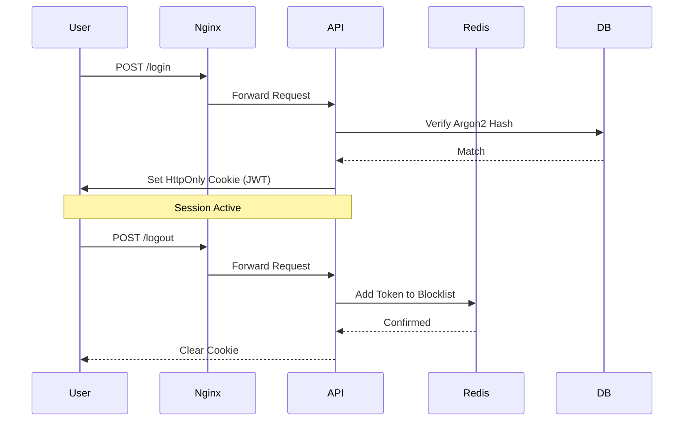

# Login Portal

[](https://github.com/alexmcook/login-portal/actions/workflows/deploy.yml)

This project aims to implement a secure authentication process for a user in a full-stack context. The client provides an interface to log in or register, and the backend handles the authentication flow and persistence to the database. Upon successful login, the `/secure` endpoint is available and provides various account details from the database.

Deployed at https://371531.xyz


## Design Decisions
The goal of this project was to develop experience in making a modern, secure web application. Rather than simply use a provided library such as Passport.js to handle the authentication workflow for me, I wanted to get a better understanding of how the internals work together. I chose Argon2 as a modern password hashing algorithm to securely store passwords, and utilized a JWT cookie workflow to authenticate the user. The user is provided a short lived authentication token (15m) and a longer lived refresh token (24h) to manage authentication state. This provided the ability to revoke user authentication by revoking their token, storing deactivated tokens in Redis until expired. This architecture balances the scalability of stateless JWTs with the security of stateful revocation.


## CI/CD
Deployment is handled through a Github Actions runner to a DigitalOcean VPS. Secrets are set through the secrets manager at the repository level and exported on deployment. The docker images are built for the client and api and then pulled and run on the host machine.


## Authentication Diagram


## Project Layout
```
.
├── client/
│   └── src/                        # React components
├── src/
│   ├── config.ts                   # Config management
│   ├── controllers/                # Endpoint handlers
│   ├── repositories/               # API <-> Database
│   ├── routes/
│   ├── services/                   # Auth, session, database, etc.               
│   ├── types/
│   └── utils/
└── test/                           # Unit tests
```
